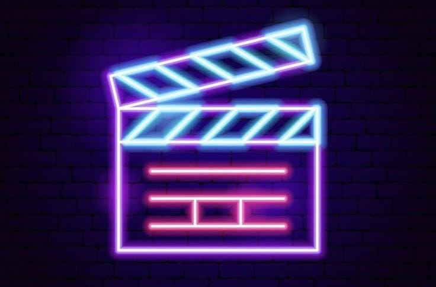

# Movie Discovery App

A modern, native Android application for browsing and discovering movies using Kotlin and Jetpack Compose.  
The application fetches movie data from The Movie Database (TMDB) API and provides an elegant, user-friendly interface for exploring popular movies, viewing details, and searching for titles.

---

## Team Members
| Name       |
|------------|
| Sama Ahmed Mohamed Abdelkareem |
| Mirna mahmoud mohamed mahmoud |
| Mouhab Mamdouh Zakaria Saleh |
| Abdelrahman Ahmed ElSayed ElQazaz |
| Lina Ashraf Sediq Hamzawy |
| Mariam Magdy Soliman Youssef |

---

## Features
- Browse a grid of popular movies fetched from TMDB API.
- View detailed information about each movie (title, synopsis, rating, release date).
- Search for movies by title.
- Modern UI/UX built with Material Design Components and Jetpack Compose.
- Secure API key storage in `gradle.properties`.
- Unit tests for core business logic.

---

## Technologies Used
- Kotlin
- Jetpack Compose
- Retrofit (Networking)
- Coil (Image Loading)
- Navigation Component
- Material Design 3
- Git & GitHub
- Unit Testing (JUnit)

---

## Project Plan

| Week  | Tasks | Deliverables |
|-------|-------|--------------|
| Week 1 | Project setup, GitHub repo creation, UI/UX wireframes, static UI for home screen | Project initialized, wireframes, static grid UI |
| Week 2 | API integration with Retrofit, dynamic movie list display | Networking layer, dynamic grid of movies |
| Week 3 | Navigation to details, movie detail screen, unit testing | Navigation working, detail screen ready, tests passing |
| Week 4 | Search functionality, security improvements, UI polish, documentation | Search feature, secure API key storage, final polish |

---

## License
This project is licensed under the MIT License.

